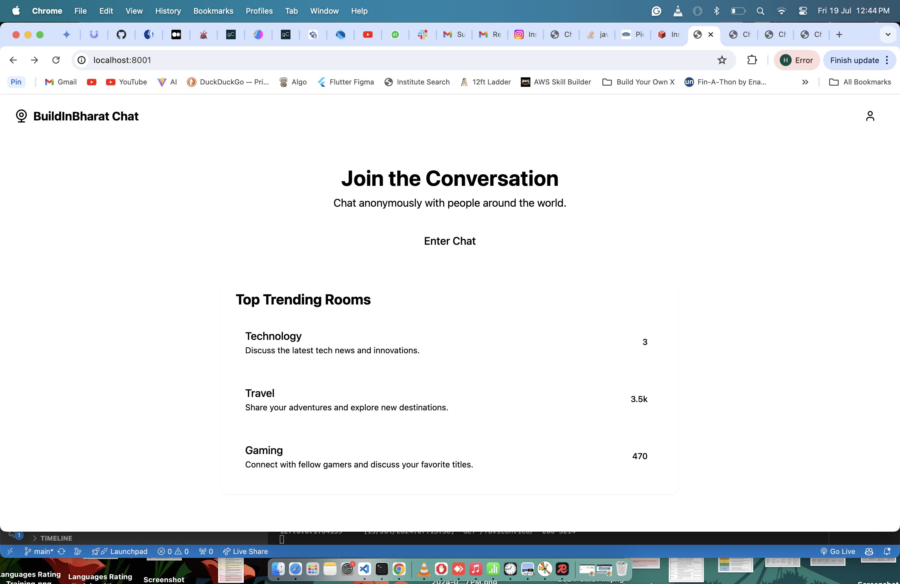
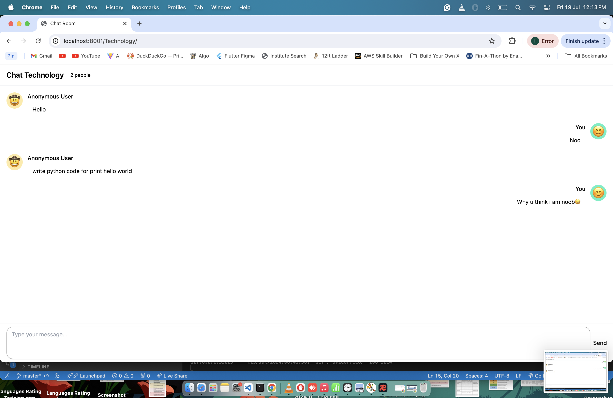

# Real-Time Chat Room with WebSockets

## Introduction
This is a Django application that features a real-time chat room where multiple members can join and chat. Additionally, it has a separate real-time view that displays the list of online members.

## Note 
I hardcoded some rooms (in `chat/view.py`) user counts to display the custom filter. You can comment it for a real preview:
```python
room_data["Travel"] = 3456
room_data["Gaming"] = 470
```

## Requirements
- Django
- Django Channels (With Daphne)
- Redis

## Setup
1. Clone the repository:
   ```bash
   git clone <repository_url>
   cd DjangoChatApp
   ```

2. Install dependencies:
   ```bash
   pip install -r requirements.txt
   ```

3. Run Redis server:
   ```bash
   redis-server
   ```
   If you don’t have Redis installed, visit [Redis Installation Guide](https://redis.io/docs/latest/operate/oss_and_stack/install/install-redis/) for instructions.

4. Run Django development server:
   ```bash
   python manage.py runserver
   ```

5. (Optional) Run Daphne server:
   ```bash
   daphne -b 0.0.0.0 -p 8001 DjangoChatApp.asgi:application
   ```

## Assumptions and Decisions
- We use Django Channels and Redis for handling WebSocket connections and channel layers.
- Online users are managed in-memory for simplicity.

## Testing
- To test the chat room, open multiple browser windows and navigate to different chat rooms.
- To test the online members view, connect and disconnect users and observe the updates.


## Screenshots
Below are some screenshots showing the chat interface, Redis insights, and terminal commands.
### Home Page


### Chat Interface

---


### Redis Insights

---


### Terminal Commands


## UI Credit
- Used [v0.dev](https://v0.dev) for UI design.
